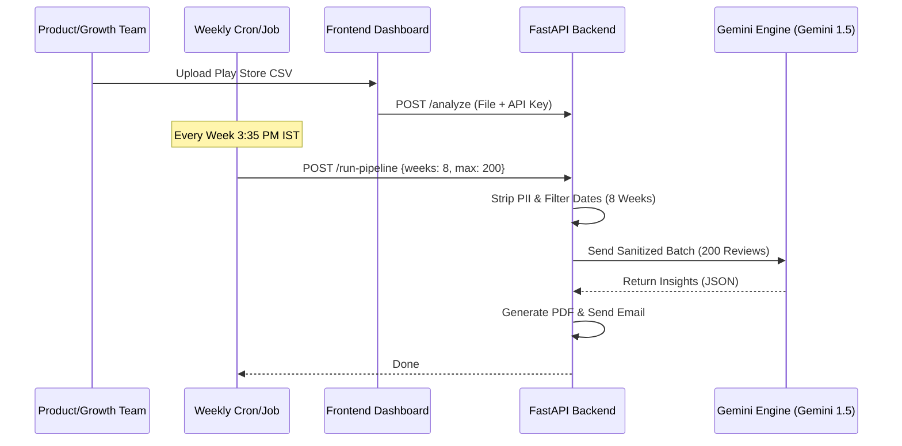

# Phase-wise Architecture: INDMoney Review Insights Analyzer

This document outlines the end-to-end technical architecture and operational flow for the INDMoney Review Insights Analyzer, powered by Groq LLM.

## 1. Objective
Transform thousands of INDMoney Play Store reviews from the last 8-12 weeks into a scannable, one-page "Weekly Pulse" report for rapid executive decision-making.

---

## 2. Phase-wise Architecture

### Phase 1: Data Ingestion & Privacy Layer
**Goal**: Securely import and sanitize raw review data at scale.
- **Data Source**: Google Play Console CSV/JSON exports.
- **Scale**: Optimized to handle **up to 1000 reviews per batch** for comprehensive coverage.
- **Temporal Filter**: Logic to isolate the last 8-12 weeks of data (based on 'date' field).
- **PII Stripper**: Regex-based engine to remove:
    - Usernames/Handles (@user)
    - Emails (name@domain.com)
    - Transaction IDs / Numeric IDs
- **Output**: A sanitized JSON array of {rating, text} for LLM consumption.

### Phase 2: LLM Intelligence Layer (Gemini)
**Goal**: Extract high-signal insights using low-latency inference.
- **Engine**: Google Gemini API with `gemini-1.5-flash`.
- **Core Logic**:
    - **Themes**: LLM identifies recurring topics (Max 5 themes) specific to INDMoney (e.g., "Mutual Fund Onboarding", "KYC Issues").
    - **Summarization**: Generates a scannable pulse (≤250 words).
    - **Quotes**: Selects 3 representative real user quotes.
    - **Actions**: Proposes 3 actionable product/growth ideas.

### Phase 3: Dashboard & Visualization Layer
**Goal**: Provide a premium UI for interacting with insights.
- **UI Architecture**: Vanilla JS + CSS (Glassmorphic Design).
- **Features**:
    - File upload dropzone.
    - Live theme pills and quote cards.
    - **Generate One-Pager**: Dedicated button to trigger the pulse report generation.
    - Summary section with dynamic MD rendering.

### Phase 4: Distribution & Reporting
**Goal**: Circular feedback loop to stakeholders.
- **Email Drafter**: Dedicated UI trigger to generate a `mailto:` link with pre-filled SUBJECT and BODY based on the analyzed results.
- **One-Pager Report**: Dedicated UI trigger to generate and download a scannable Markdown/PDF "Weekly Pulse" report.

### Phase 7: Automated Weekly Scheduler
**Goal**: Zero-touch weekly reporting sent to leadership.
- **Trigger**: Every Week at **3:35 PM IST**.
- **Recipient**: `Shraddha.jagtap14081996@gmail.com` (Fixed).
- **Constraints**:
    - **Sample Size**: Exactly 200 reviews.
    - **Time Lookback**: Rolling 8-week window.
- **Process**:
    - Background script runs `analyzer -> PDF generator -> SMTP sender`.

---

## 3. High-Level System Flow

---

## 4. Value Proposition: Who This Helps

| Stakeholder | Use Case | Benefit |
| :--- | :--- | :--- |
| **Product / Growth** | Spotting drop-offs in new investment flows. | Faster fixing of high-friction UI/UX. |
| **Support Teams** | Monitoring common complaints after a new release. | Proactive acknowledgment of wide-spread issues. |
| **Leadership** | Quick health check of brand sentiment. | High-level visibility without reading 1000+ reviews. |

---

## 5. Operations & Maintenance

### How to Re-run for a New Week
1. Export the latest reviews from Google Play Console for the desired date range.
2. Open the INDMoney Insights Dashboard.
3. Upload the new `.csv` file.
4. The system automatically recalculates the "Weekly Pulse".

### Theme Legend (Base Categories)
While the LLM is dynamic, it primarily groups into:
- **Performance**: Lag, crashes, battery drain.
- **Onboarding**: KYC struggles, SIP setup delays.
- **Portfolio**: Accuracy of portfolio tracking, stock syncing.
- **UI/UX**: Navigation difficulty, font size, dark mode.
- **Support**: Response time, refund queries.
